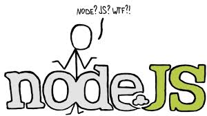

Node.js for Newbies
=================


###**What is Node.js**
Node.js is a event-driven programming, Javascript in server side. 
What? Where? Event what? 
These where my first reactions when I start reading about Node.js and trying to learn about it.
For all these questions I decided to write a small tutorial/post about Node.js for the web developers/ developers that want to start using Node.js and want a easy landing.

Why? You ask your selfs, the reason is that when I start learning/playing with Node.js, I wish someone wrote the terminology, tools, what to do for the beginners. 
So if you want to start using Node.js, I hope I can help a little bit and give you some intro about it. 
Lets start our journey together.

####**Let's the terminology begging**

_I promisse stay tunned, will be code._

**Node.js**
*Node.js is an open source, cross-platform runtime environment for server-side and networking applications. Node.js applications are written in JavaScript, and can be run within the Node.js runtime on OS X, Microsoft Windows, Linux and FreeBSD.*

**npm**
npm is a Node.js package manager. As its name would imply, you can use it to install node programs. Also, if you use it in development, it makes it easier to specify and link dependencies.

**npm install**
This command installs a package, and any packages that it depends on. If the package has a shrinkwrap file, the installation of dependencies will be driven by that.

**npm-shrinkwrap**: You can control exactly which versions of each dependency 
will be used when your package is installed.
See [npm-shrinkwrap](https://www.npmjs.org/doc/cli/npm-shrinkwrap.html) for more information.

**package.json**
This document is all you need to know about what's required in your package.json file. It must be actual JSON, not just a JavaScript object literal.
You can read more about packge.json in [here.](https://www.npmjs.org/doc/files/package.json.html)
If you don't want to read all the documentation about it, read at least the section of the property 'name', it will save a lot of headaches, when writing new package.json files read [this.](https://www.npmjs.org/doc/files/package.json.html#name) 

###**Lets get our hands dirty**
####Prepare your environment

 1. Install Node.js and npm(npm is installed together with Node.js) - download from [here.](http://nodejs.org/download/)
 2. Check Node.js and npm version
 3. Open your command line and run the following command: *node --version && npm --version*:
 4. This is enough for now, you can start running Node.js programs
```
node --version && npm --version
v0.10.28
1.4.9
```

####**Lets write our First Program**
```
var http = require('http');
http.createServer(function (req, res) {
  res.writeHead(200, {'Content-Type': 'text/plain'});
  res.end('Hello World\n');
}).listen(1337, '127.0.0.1');
console.log('Server running at http://127.0.0.1:1337/');
```

 1. This simple web server written in Node responds with "Hello World" for every request.
 2. To run the server, put the following code into a file example.js and execute it with the node program from the command line: 
```
node example.js
```
 3. Open Browser and write in
the address bar: http://127.0.0.1:1337/
output in command line: 

```Server running at http://127.0.0.1:1337/```

